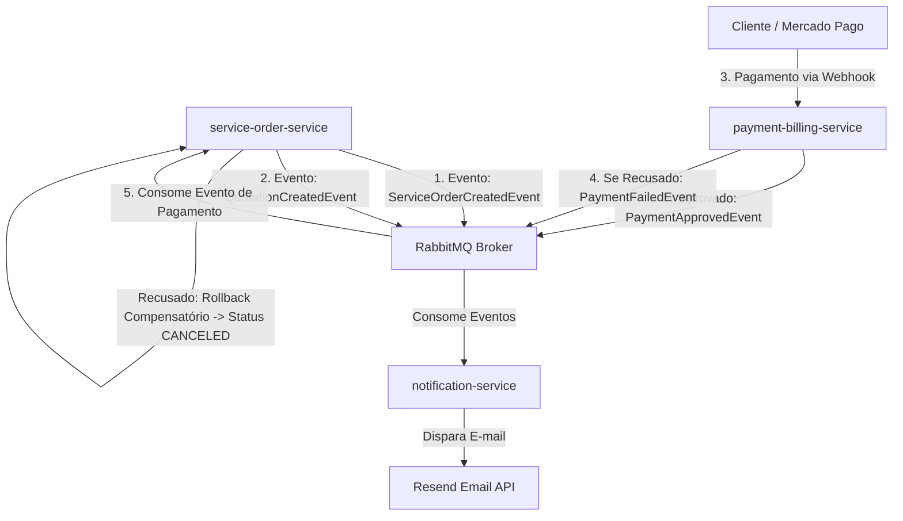

# Tech Challenge Fase 3 — Sistema Distribuído de Ordens de Serviço & Saga Pattern

FIAP — Pós Tech | Arquitetura de Software
Java 17 · Spring Boot 3 · MySQL (SQL) · MongoDB (NoSQL) · RabbitMQ · Saga Pattern · Clean Architecture · Kubernetes · GitHub Actions

---

## 🚀 Arquitetura Distribuída & Microsserviços

O sistema foi refatorado de um monólito para uma **Arquitetura Orientada a Eventos em Microsserviços**, onde cada serviço é 100% independente, com seu próprio banco de dados, repositório e infraestrutura (Database-per-Service).

### 🧩 Divisão dos Microsserviços

1. **`service-order-service` (OS Service)**
   - **Responsabilidade:** Abertura da OS, diagnóstico técnico, fila de execução de reparos, histórico e transição de status.
   - **Banco de Dados:** Relacional (SQL) — MySQL (`oficina_db`).
   - **Porta HTTP:** `8080`.

2. **`payment-billing-service` (Billing Service)**
   - **Responsabilidade:** Orçamentos, cobrança PIX via SDK do Mercado Pago e recebimento de Webhooks de status de pagamento.
   - **Banco de Dados:** Relacional (SQL) — MySQL (`payment_db`).
   - **Porta HTTP:** `8081`.

3. **`notification-service` (Notification Service)**
   - **Responsabilidade:** Consumo de eventos assíncronos via RabbitMQ e envio de e-mails/notificações de orçamento e status via API do Resend.
   - **Banco de Dados:** Não-Relacional (NoSQL) — MongoDB (`notification_db`) para log de auditoria de notificações enviadas.
   - **Porta HTTP:** `8082`.

---

## ⚡ Implementação do Saga Pattern (Saga Coreografada)

Para coordenar a transação distribuída entre a abertura da OS, aprovação do orçamento, execução e pagamento com rollback seguro, adotamos o **Saga Pattern Coreografado**.

### 💡 Justificativa da Escolha da Saga Coreografada
1. **Desacoplamento Total:** Cada microsserviço reage autonomamente a eventos emitidos no RabbitMQ sem a necessidade de um orquestrador centralizado que seja ponto único de falha.
2. **Escalabilidade Independente:** Microsserviços como `notification-service` podem processar picos de notificações sem impactar o tempo de resposta da API principal.
3. **Resiliência e Compensação Automática:** Caso o pagamento seja rejeitado no `payment-billing-service`, o evento compensatório (`PaymentFailedEvent`) é emitido e consumido pelo `service-order-service`, acionando a compensação que cancela a OS (`CANCELED`).



---

## 🧪 Qualidade, Testes e BDD

- **Testes Unitários:** Presentes nos 3 microsserviços cobrindo Use Cases, Entities e Listeners.
- **BDD (Behavior-Driven Development):** Testes funcionais completos implementados via **Cucumber / Gherkin** no arquivo `service_order_saga.feature`.
- **Relatórios de Cobertura:** Cobertura de código rastreada e gerada via **JaCoCo Plugin** (`target/site/jacoco`).
- **Análise de Qualidade:** Integração configurada no CI com **SonarQube**.

---

## 🐳 Como Executar o Projeto com Todos os Microsserviços Conectados

### Pré-requisitos
- Docker Desktop e Docker Compose instalados.
- Java 17 e Maven (caso deseje rodar os testes manualmente).

### Passo a Passo

1. **Subir toda a Infraestrutura e Microsserviços com Docker Compose:**
   Na pasta raiz do projeto (`fase-3`), execute:
   ```bash
   docker-compose up -d --build
   ```

2. **Verificar os Contêineres Ativos:**
   ```bash
   docker-compose ps
   ```
   Serão iniciados os 6 contêineres:
   - `mysql-service-order` (Porta `3307`)
   - `mysql-payment` (Porta `3308`)
   - `mongo-notification` (Porta `27017`)
   - `fiap-rabbitmq` (Portas `5672` AMQP / `15672` Dashboard Web)
   - `service-order-service` (Porta `8080`)
   - `payment-billing-service` (Porta `8081`)
   - `notification-service` (Porta `8082`)

3. **Acessar o Painel do RabbitMQ:**
   - URL: `http://localhost:15672`
   - Usuário: `guest` / Senha: `guest`

4. **Acessar a Documentação Swagger das APIs:**
   - **OS Service:** `http://localhost:8080/swagger-ui.html`
   - **Payment Billing Service:** `http://localhost:8081/swagger-ui.html`
   - **Notification Service:** `http://localhost:8082/swagger-ui.html`

5. **Executar os Testes Unitários e BDD via linha de comando:**
   ```bash
   # Rodar testes e BDD no OS Service
   cd ordem-de-service && ./mvnw clean test

   # Rodar testes no Billing Service
   cd ../payment-billing && ./mvnw clean test

   # Rodar testes no Notification Service
   cd ../notification-service && ./mvnw clean test
   ```
