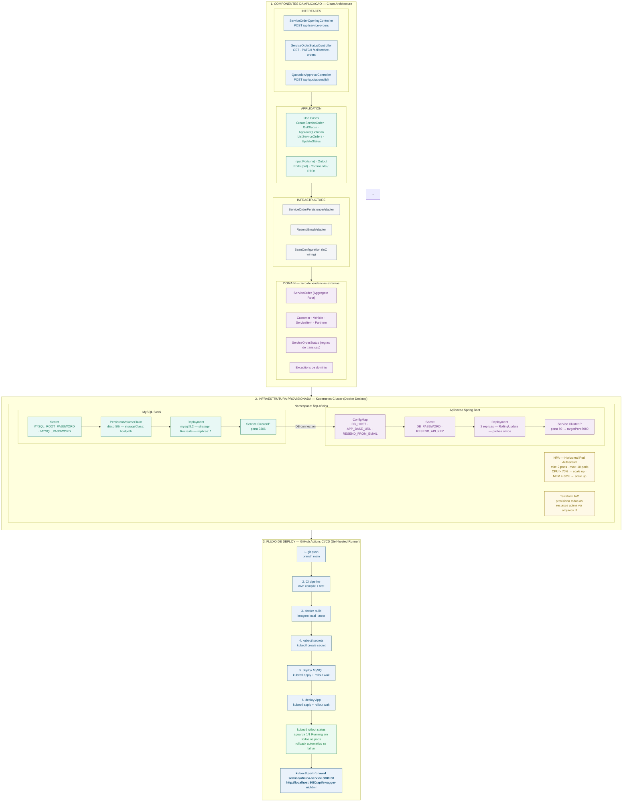

# Tech Challenge Fase 2 — Sistema de Gestao de Ordens de Servico

FIAP — Pos Tech | Arquitetura de Software
Java 17 · Spring Boot 3 · MySQL · Clean Architecture · Kubernetes · Terraform · GitHub Actions

---

## Descricao da Solucao

Este projeto e a evolucao do sistema de gestao de Ordens de Servico (OS) de uma oficina mecanica desenvolvido na Fase 1. O objetivo desta fase foi garantir qualidade, resiliencia e escalabilidade, incorporando praticas modernas de infraestrutura e automacao.

### Objetivos desta fase

- Refatorar o codigo aplicando Clean Architecture e Clean Code
- Implementar testes automatizados cobrindo os fluxos criticos
- Containerizar a aplicacao com Docker
- Orquestrar com Kubernetes incluindo escalonamento automatico via HPA
- Provisionar infraestrutura com Terraform (IaC)
- Automatizar o ciclo de entrega com GitHub Actions (CI/CD)
- Integrar envio de e-mails via Resend para aprovacao de orcamentos

---

## Demonstração em Vídeo

Confira a explicação completa da solução, arquitetura e execução do projeto:

👉 https://www.youtube.com/watch?v=kpL6lHo3Om8

---

## Arquitetura da Solucao

### Desenho da Arquitetura



### Componentes da Aplicacao

```
src/main/java/com/fiap/tech_challenge_fase2/
│
├── domain/
│   ├── entity/          ServiceOrder (Aggregate Root), Customer, Vehicle, ServiceItem, PartItem
│   ├── enums/           ServiceOrderStatus (com regras de transicao)
│   └── exception/       ServiceOrderNotFoundException, InvalidStatusTransitionException
│
├── application/
│   ├── port/in/         CreateServiceOrderUseCase, GetServiceOrderStatusUseCase,
│   │                    ApproveQuotationUseCase, ListServiceOrdersUseCase,
│   │                    UpdateServiceOrderStatusUseCase
│   ├── port/out/        ServiceOrderRepositoryPort, EmailNotificationGateway
│   ├── usecase/         Implementacoes dos Use Cases
│   └── dto/             CreateServiceOrderCommand, ApproveQuotationCommand, UpdateStatusCommand
│
├── infrastructure/
│   ├── persistence/     JPA Entities, ServiceOrderJpaRepository, ServiceOrderPersistenceAdapter
│   ├── email/           ResendEmailAdapter
│   └── config/          BeanConfiguration (wiring de IoC)
│
└── interfaces/
    ├── controller/      ServiceOrderOpeningController, ServiceOrderStatusController,
    │                    QuotationApprovalController, GlobalExceptionHandler
    ├── dto/             CreateServiceOrderRequest, UpdateStatusRequest, ServiceOrderResponse
    └── mapper/          ServiceOrderMapper
```

### Infraestrutura Provisionada

```
Cluster Kubernetes — Namespace: fiap-oficina

MySQL
  Secret         senhas armazenadas com seguranca
  PVC (5Gi)      disco persistente para os dados do banco
  Deployment     container mysql:8.2 com health checks
  Service        porta 3306 acessivel internamente

Aplicacao Spring Boot
  ConfigMap      variaveis nao sensiveis (DB_HOST, APP_BASE_URL, etc)
  Secret         senha do banco e API key do Resend
  Deployment     2 replicas com startup, readiness e liveness probes
  Service        porta 80 acessivel internamente
  HPA            escala de 2 a 10 pods quando CPU > 70% ou memoria > 80%
```

### Fluxo de Deploy

```
git push origin main
        |
        v
GitHub Actions detecta o push
        |
        v
ci.yml  compila o projeto com Maven
        roda os testes automatizados (H2 em memoria)
        gera o JAR
        |
        v (apenas na main)
cd.yml  docker build (imagem local)
        kubectl apply namespace e configmap
        cria ou atualiza secrets com credenciais reais
        deploy do MySQL e aguarda ficar pronto
        deploy da aplicacao com a imagem nova
        aguarda pods ficarem Running
        exibe status final
        |
        v
kubectl port-forward service/oficina-service 8080:80 -n fiap-oficina
        |
        v
http://localhost:8080/api/swagger-ui.html
```

### Fluxo de Status da OS

```
RECEIVED -> DIAGNOSIS -> AWAITING_APPROVAL -> EXECUTION -> FINISHED -> DELIVERED
                               |
                    E-mail enviado via Resend
                    com links Aprovar / Recusar
                               |
              POST /api/quotations/{id}?token=X&approved=true|false
```

---

## Execucao Local

### Pre-requisitos

- Java 17
- Maven 3.9+
- Docker Desktop

### Subindo com Docker Compose

```bash
# 1. Clone o repositorio
git clone https://github.com/CarlosDanyel/Tech-Challenge-Fase-2.git
cd Tech-Challenge-Fase-2

# 2. Crie o arquivo .env na raiz
cp .env.example .env
# Edite o .env com sua chave real do Resend

# 3. Suba a aplicacao
docker compose up --build
```

Acesse:
- Swagger: http://localhost:8080/api/swagger-ui.html
- Health: http://localhost:8080/api/actuator/health

---

## Deploy em Kubernetes

### Pre-requisitos

- Docker Desktop com Kubernetes habilitado
- kubectl configurado (kubectl get nodes deve retornar docker-desktop Ready)

### Passo a passo

```bash
# 1. Build da imagem Docker
docker build -t tech-challenge-fase2:latest .

# 2. Aplica todos os manifestos
kubectl apply -k k8s/

# 3. Aguarda os pods ficarem prontos
kubectl get pods -n fiap-oficina -w

# 4. Abre o acesso local
kubectl port-forward service/oficina-service 8080:80 -n fiap-oficina
```

Acesse: http://localhost:8080/api/swagger-ui.html

### Comandos uteis

```bash
# Ver todos os recursos
kubectl get all -n fiap-oficina

# Ver logs da aplicacao
kubectl logs -f deployment/oficina-app -n fiap-oficina

# Ver o HPA
kubectl get hpa -n fiap-oficina

# Reiniciar apos novo build
kubectl rollout restart deployment/oficina-app -n fiap-oficina

# Remover tudo
kubectl delete -k k8s/
```

---

## Provisionamento com Terraform

### Pre-requisitos

```bash
# Instalar o Terraform (macOS)
brew install terraform

# Verificar instalacao
terraform version
```

### Passo a passo

```bash
# 1. Defina as variaveis sensiveis no terminal
export TF_VAR_resend_api_key="re_sua_chave_real"
export TF_VAR_mysql_password="oficina_pass"
export TF_VAR_mysql_root_password="root_password"

# 2. Build da imagem Docker
docker build -t tech-challenge-fase2:latest .

# 3. Entre na pasta do Terraform
cd infra/

# 4. Inicialize (somente na primeira vez)
terraform init

# 5. Visualize o que sera criado
terraform plan

# 6. Crie a infraestrutura
terraform apply

# 7. Volte para a raiz
cd ..

# 8. Abra o acesso
kubectl port-forward service/oficina-service 8080:80 -n fiap-oficina

# 9. Pods subindo
kubectl get pods -n fiap-oficina -w
```

### Recursos criados pelo Terraform

| Recurso | Tipo | Descricao |
|---------|------|-----------|
| fiap-oficina | Namespace | Isola todos os recursos |
| mysql-secrets | Secret | Senhas do MySQL |
| mysql-pvc | PVC | Disco persistente de 5Gi |
| mysql | Deployment | Container MySQL 8.2 |
| mysql | Service | Acesso interno porta 3306 |
| oficina-config | ConfigMap | Variaveis nao sensiveis |
| oficina-secrets | Secret | Senha DB e API key Resend |
| oficina-app | Deployment | App Spring Boot com 2 replicas |
| oficina-service | Service | Acesso interno porta 80 |
| oficina-hpa | HPA | Escalonamento automatico |

### Remover infraestrutura

```bash
cd infra/
terraform destroy
```

---

## CI/CD — GitHub Actions

O pipeline roda automaticamente via Self-hosted Runner na maquina local.

### Workflows

| Arquivo | Quando roda | O que faz |
|---------|------------|-----------|
| ci.yml | Todo push e PR | Compila, testa e gera JAR |
| cd.yml | Push na main | Build Docker e deploy K8s |

### Como ativar o pipeline

```bash
# Inicia o runner (deixe o terminal aberto)
cd actions-runner
./run.sh
```

### Secrets necessarios no GitHub

```
Settings -> Secrets and variables -> Actions

DB_PASSWORD           oficina_pass
MYSQL_ROOT_PASSWORD   root_password
RESEND_API_KEY        sua chave do Resend
```

---

## APIs

### Endpoints disponiveis

| Metodo | Rota | Descricao |
|--------|------|-----------|
| POST   | /api/service-orders | Abre uma nova OS |
| GET    | /api/service-orders | Lista OS ativas ordenadas |
| GET    | /api/service-orders/{id}/status | Consulta status da OS |
| PATCH  | /api/service-orders/{id}/status | Atualiza status da OS |
| GET    | /api/quotations/{id} | Aprova ou recusa orcamento |

### Ordenacao da listagem

```
Em Execucao > Aguardando Aprovacao > Diagnostico > Recebida
Dentro do mesmo status: mais antigas primeiro
OS Finalizadas e Entregues: excluidas da listagem
```

---

## Links

- Collection Postman: https://drive.google.com/drive/folders/1LjzZtvXS1seqGIvhLiqSc5JJhe1r9oXj?usp=sharing
- Swagger UI: http://localhost:8080/api/swagger-ui.html (com a aplicacao rodando)

---

## Testes

```bash
# Roda todos os testes
mvn test

# Testes de dominio
mvn test -Dtest="ServiceOrderTest"

# Testes de use cases
mvn test -Dtest="*UseCaseTest"

# Testes de controller
mvn test -Dtest="*ControllersTest"
```

### Cobertura

| Teste | Tipo | Cobre |
|-------|------|-------|
| ServiceOrderTest | Unitario | Transicoes de status, aprovacao, calculo de total |
| CreateServiceOrderUseCaseTest | Unitario | Criacao de OS, envio de e-mail |
| UpdateServiceOrderStatusUseCaseTest | Unitario | Atualizacao de status, token de aprovacao |
| ApproveQuotationUseCaseTest | Unitario | Aprovacao e recusa de orcamento |
| ServiceOrderControllersTest | Integracao | HTTP, validacao, todos os controllers |

---

## Tecnologias

| Tecnologia | Versao | Uso |
|-----------|--------|-----|
| Java | 17 | Linguagem |
| Spring Boot | 3.2.3 | Framework |
| MySQL | 8.2 | Banco de dados |
| Flyway | — | Migrations |
| Docker | — | Containerizacao |
| Kubernetes | 1.28 | Orquestracao |
| Terraform | 1.5+ | IaC |
| GitHub Actions | — | CI/CD |
| Resend | — | Envio de e-mails |
