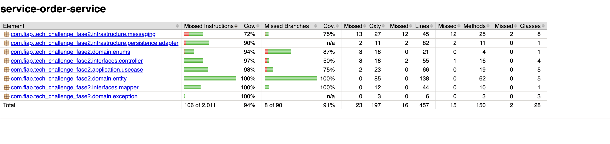

# Service Order Microservice (`ordem-de-service`)

Serviço responsável pela abertura, diagnóstico, atualização de status e acompanhamento do histórico das Ordens de Serviço (OS), atuando como **orquestrador central do fluxo de negócio** no ecossistema da oficina.

> [!IMPORTANT]
> **Inicialização e Execução**: As instruções completas para inicialização, execução local e implantação em ambiente Kubernetes deste microsserviço e do ecossistema encontram-se documentadas no repositório [**oficina-infra**](https://github.com/CarlosDanyel/oficina-infra).

---

## 🛠️ Tecnologias Utilizadas

- **Linguagem & Framework**: Java 17, Spring Boot 3.3.5
- **Banco de Dados**: MySQL 8 (Spring Data JPA + Flyway Migrations)
- **Mensageria**: RabbitMQ (Spring AMQP)
- **Documentação de API**: OpenAPI 3 / Swagger UI (`springdoc-openapi`)
- **Testes & Cobertura**: JUnit 5, Mockito, Cucumber (BDD), JaCoCo
- **Containerização & Orquestração**: Docker, Kubernetes
- **CI/CD**: GitHub Actions, SonarQube

> [!WARNING]
> **Configuração Obrigatória — Arquivo `.env`**: Para executar o projeto localmente ou em contêineres, é necessário criar o arquivo `.env` na **raiz do projeto** a partir do modelo [`.env.example`](./.env.example). O mesmo arquivo `.env` deve ser copiado para o diretório `k8s/` antes de aplicar os manifests no Kubernetes. Sem esse arquivo as variáveis de ambiente (banco de dados, RabbitMQ, etc.) não serão injetadas e o serviço não subirá corretamente.

---

## 📐 Documentação da Arquitetura do Serviço

Projetado seguindo os princípios da **Clean Architecture** e **Domain-Driven Design (DDD)**, com o domínio rico isolado de frameworks e detalhes de infraestrutura.

### Estrutura de Pacotes

```text
com.fiap.tech_challenge_fase2/
├── application/       # Casos de Uso (Use Cases), Portas de Entrada/Saída, DTOs
├── domain/            # Entidades (ServiceOrder, Customer, Vehicle), Enums de Status, Regras de Transição
└── infrastructure/    # Adaptadores: Persistência JPA/MySQL, Mensageria RabbitMQ (Saga)
```

### Participação no Saga Pattern (Coreografado)

O `ordem-de-service` atua como **serviço central** no ecossistema do Saga Pattern Coreografado, publicando eventos de domínio e reagindo a resultados de etapas posteriores:

- **Publicador de Eventos**: Emite `ServiceOrderCreatedEvent` ao abrir uma OS e `QuotationCreatedEvent` ao gerar orçamento.
- **Consumidor de Compensação**: Reage a `PaymentApprovedEvent` (sucesso → `DELIVERED`) e `PaymentFailedEvent` (rollback → `CANCELED`).
- **Máquina de Estados**: Garante consistência transacional com regras rígidas de transição entre os 7 status da OS.

#### Eventos do Saga

| Evento | Routing Key | Direção | Ação |
|---|---|---|---|
| `ServiceOrderCreatedEvent` | `service-order.created` | ⬆️ Publica | Notifica abertura de OS (notification-service) |
| `QuotationCreatedEvent` | `quotation.created` | ⬆️ Publica | Envia orçamento para aprovação do cliente |
| `PaymentApprovedEvent` | `payment.approved` | ⬇️ Consome | Transiciona OS → `DELIVERED` (Happy Path) |
| `PaymentFailedEvent` | `payment.failed` | ⬇️ Consome | Transiciona OS → `CANCELED` (Rollback/Compensação) |

### Máquina de Estados da Ordem de Serviço

```
RECEIVED → DIAGNOSIS → AWAITING_APPROVAL ⇄ DIAGNOSIS (recusa)
                                    ↓
                               EXECUTION → FINISHED → DELIVERED

Qualquer estado (exceto terminais) → CANCELED (compensação)
```

---

## 📊 Evidências de Cobertura de Testes

Os testes unitários e BDD garantem a confiabilidade do serviço com cobertura superior a 80% exigidos pela pipeline de CI/CD.

```bash
# Executar a suíte completa de testes e gerar o relatório JaCoCo
./mvnw clean verify
```

### Relatório de Cobertura de Testes (JaCoCo)


---

## 📑 Swagger UI e Coleção Postman

### 1. Documentação Swagger UI / OpenAPI

Quando o serviço estiver em execução (localmente ou via port-forward no Kubernetes):

- **Swagger UI**: [http://localhost:8080/swagger-ui.html](http://localhost:8080/swagger-ui.html)
- **OpenAPI Spec (JSON)**: [http://localhost:8080/api-docs](http://localhost:8080/api-docs)
- **Health Check**: [http://localhost:8080/actuator/health](http://localhost:8080/actuator/health)

### 2. Coleção do Postman

A coleção do Postman para testes do ecossistema encontra-se no repositório:

- 📬 **[postman_collection.json](./postman_collection.json)**

A coleção contempla:
- **Happy Path**: Abertura OS → Diagnóstico → Orçamento → Aprovação → Pagamento PIX → Entrega
- **Rollback**: Falha de pagamento → Compensação (OS → `CANCELED`)
